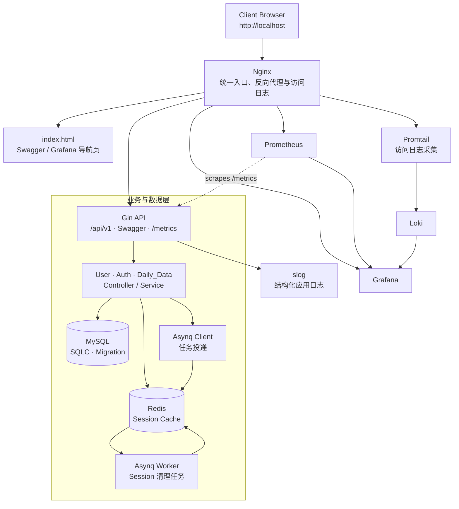

# Go Estate

中文 | [English](README_en.md)

## 项目介绍

一个面向房地产成交数据场景的 Go 后端服务。项目以 Gin 为 HTTP 框架，围绕用户、认证与每日成交数据构建清晰的 Controller / Service / DAO 分层；同时将会话安全、角色权限、可观测性、异步任务、容器化部署和 CI 测试纳入同一工程闭环。它的目标不只是提供接口，更是在个人开源项目中实践可维护、可测试且对前端友好的后端服务设计。

这份 README 面向技术面试审阅：重点呈现技术选型背后的工程取舍、可验证的测试策略，以及从客户端入口到运行观测的一体化设计。

### 系统架构图



## 核心技术栈

| 分类     | 技术                   | 在项目中的应用与解决的问题                                                                                                                                                               |
| -------- | ---------------------- | ---------------------------------------------------------------------------------------------------------------------------------------------------------------------------------------- |
| 基础架构 | Docker、Docker Compose | 以多容器方式编排 API、MySQL、Redis、数据库迁移与观测组件；MySQL 健康检查通过后执行 Migration，Migration 完成后 API 才启动，减少本地与 CI 环境差异。                                      |
| 基础架构 | Nginx                  | 提供统一入口、反向代理与访问日志，转发 API、Swagger、Grafana 和 Prometheus 等服务。                                                                                                      |
| 基础架构 | GitHub Actions         | CI 分为单元测试与集成测试两个阶段：先执行覆盖率测试与构建检查，再拉起 Docker 环境、等待迁移完成并执行真实数据库测试。                                                                    |
| 存储     | MySQL、golang-migrate  | MySQL 持久化用户、会话与每日成交数据；版本化 Migration 保证表结构与初始数据可重复演进。                                                                                                  |
| 存储     | SQLC                   | 从 SQL 查询生成类型安全的 DAO，避免手写扫描与字符串拼接；Store 同时抽象事务执行能力，使密码变更与 Session 失效可在同一事务边界内完成。                                                   |
| 存储     | Redis                  | 缓存 Refresh Token 对应的 Session，认证刷新优先走缓存、未命中时回源 MySQL 并异步回填，在一致性与读取性能之间取得平衡。                                                                   |
| 可观测性 | Prometheus、Grafana    | Gin 接入 Prometheus 指标采集，Grafana 通过预置数据源和 Dashboard 展示服务运行状态。                                                                                                      |
| 可观测性 | Loki、Promtail、slog   | Compose 预置日志聚合组件，Promtail 配置定义 Gin / Nginx 日志采集路径；服务侧用结构化 `slog` 记录 HTTP 状态、业务码、耗时、路径和错误信息，为接入 Loki 后的检索、定位与告警提供统一字段。 |
| 异步     | Asynq                  | 基于 Redis 投递 Session 缓存清理任务。用户登出或修改密码时，先完成关键数据库状态变更，再异步删除缓存；任务具备超时和重试配置，避免非关键 I/O 阻塞主请求。                                |

## 模块与测试保障

### 核心业务模块

- **User（用户管理）**：支持普通用户注册、管理员创建 VIP、用户资料查询与更新。Service 层落实“本人或管理员”的访问边界；密码更新会在事务中失效相关 Session，并通过异步任务清理缓存，避免旧令牌继续可用。
- **Auth（认证与会话）**：完成账号登录、Access Token 刷新和按设备登出。登录时签发 Access / Refresh Token，将 Refresh Token 写入 `HttpOnly` Cookie，并基于设备标识、User-Agent、客户端 IP 维护 Session；刷新流程采用 Redis 优先、MySQL 兜底的校验策略。
- **Daily_Data（每日成交数据）**：提供按日、按时间段与全量查询能力，并把数据范围直接映射到角色能力：`User` 可查单日、`VIP` 可查区间、`Admin` 可查全量，避免把权限判断散落在业务代码中。

### 分层测试策略

项目采用“**Service / Controller 层单测 + DAO 层真实数据库集成测试**”的分层测试策略，让测试速度与可信度兼顾。

- **Controller 单测**：使用 Gin 的测试请求与 Mock Service / Token Maker，验证路由、中间件、参数绑定、鉴权和统一响应契约。
- **Service 单测**：通过 `gomock` 隔离 Store、Redis Cache、任务分发器等外部依赖，聚焦权限、会话、事务编排、异常映射等业务规则。
- **DAO 集成测试**：DAO 测试使用 `integration` build tag 连接真实 MySQL，直接验证 SQLC 生成查询、唯一约束、会话状态与数据读写行为，而不是只依赖 SQL Mock。
- **CI 护栏**：`.github/workflows/unit-test.yml` 先运行 `go test -v -cover -short ./...`，再通过 Docker Compose 启动 MySQL 与迁移服务，最后执行 `go test -v -tags=integration ./...`。这能尽早发现代码逻辑问题和真实 SQL / Schema 不一致问题。

## 工程化亮点

### 中间件：把请求上下文与安全边界前置

业务 API 通过分层路由组组合中间件：`/api/v1` 下先经过元数据校验，受保护路由再经过认证校验，具体资源路由按需叠加角色校验。每个中间件在失败时统一下发业务响应并 `Abort` 请求链，保证未通过校验的请求不会进入 Controller。

- **Metadata 提取与校验**：`RequireMetadata` 强制业务请求提供 `X-Device-ID` 与 `User-Agent`，同时提取 Client IP 并写入 Gin Context。认证模块据此将 Refresh Session 绑定到设备、客户端特征与 IP，为多设备会话管理、风险追踪和“按设备登出”提供稳定上下文，而不是只依赖一个无状态 Token。
- **Token 认证**：`RequireAuth` 只接受规范的 `Bearer` 认证头，校验 JWT 的签名、有效期和 Token 类型（仅 Access Token 可进入受保护资源），并将解析后的 Payload 注入 Context。Controller / Service 无须重复解析令牌，只消费可信身份信息。
- **角色授权**：`RequireRoles` 从已认证的 Payload 中读取角色，并与路由声明的允许角色集合比对。创建 VIP、查询单日 / 区间 / 全量成交数据等能力通过路由就近声明权限，形成清晰、可审计的 RBAC 边界。
- **结构化请求日志**：`SlogMiddleware` 在请求完成后统一记录状态码、业务码、方法、路径、来源 IP、耗时与内部错误，并依据 HTTP 状态和业务码划分 Info / Warn / Error 级别，令应用日志可直接服务于排障和告警。

### 路由桥接与统一下发：控制层只处理业务

路由注册层负责组织“公开元数据路由”和“受认证路由”，并为各模块装配 Controller 与权限策略；Controller 则统一采用“返回数据或返回错误”的处理模型。`response.Wrapper` 将该模型桥接为 Gin 原生 Handler：成功路径统一下发成功结构，失败路径集中进入错误处理器。

- Controller 因而只关注请求绑定、DTO 转换和 Service 调用，不需要在每个分支重复编写 JSON 序列化、状态码和日志逻辑。
- 成功响应固定为 `code / msg / data`，错误响应固定为 `code / msg`；前端只需围绕同一契约构建拦截器和提示逻辑。
- 路由层的 `NoRoute` 同样返回统一结果结构，避免框架默认 404 页面破坏客户端解析。它保留 HTTP 404，作为“请求的资源路径不存在”这一协议层错误；正常业务失败仍走下述业务码策略。

### `BizError` 与统一响应：面向前端的错误契约

项目以 `BizError` 作为跨层错误语言，包含对外稳定的 `Code`、可展示的 `Msg` 与仅供服务端追踪的底层 `Err`。Service 可以通过 `WithErr` 保留数据库、缓存或任务系统的根因，而客户端不会收到内部实现细节。

| 错误类别    | 业务码区间         | HTTP 策略 | 前端处理价值                                                   |
| ----------- | ------------------ | --------- | -------------------------------------------------------------- |
| 参数校验    | `400xx`            | `200`     | 展示字段或格式提示；校验器错误会统一翻译为可读信息。           |
| 认证 / 授权 | `401xx`            | `200`     | 触发登录、刷新令牌或权限提示，而不是将业务拒绝误判为网络失败。 |
| 资源 / 冲突 | `404xx`、`409xx`   | `200`     | 稳定地区分“对象不存在”和“用户名 / 邮箱冲突”等可预期业务结果。  |
| 服务端异常  | `500xx` 或未知错误 | `500`     | 客户端执行兜底提示；服务端记录原始错误用于排查。               |

- `response.Fail` 通过 `errors.As` 识别参数绑定错误与 `BizError`：前者转化为统一校验响应，后者按业务码输出；未知错误会被收敛为通用的 `50000`，防止泄漏内部信息。
- 对于可预期的业务错误，HTTP 统一返回 `200`，以 `Code + Msg` 表达业务结果；这使前端在网关、浏览器和移动端场景下都能用一套稳定规则处理登录失效、权限不足、资源冲突等状态。
- 只有 `500xx` 业务异常和未分类错误返回 HTTP `500`。前述 `NoRoute` 是刻意保留 HTTP `404` 的协议层例外，但仍遵循相同的 JSON 结果结构。
- `response.Fail` 会将错误写入 Gin Context，`SlogMiddleware` 再关联 `BizCode` 输出日志；由此形成“对前端稳定、对后端可追溯”的双轨错误处理机制。

## 快速启动

### 前置条件

- 已安装 Docker Desktop（包含 Docker Compose）。
- 本项目的 Compose 配置包含本地开发默认凭据，仅应用于开发和演示环境；部署生产前应通过安全的环境变量或密钥管理替换。

### 一键拉起

```bash
git clone https://github.com/raozhaizhu/go-estate.git
cd go-estate
docker compose up -d --build
```

旧版 Docker Compose 也可使用：

```bash
docker-compose up -d --build
```

该命令会启动 API、MySQL、Redis、Migration、Nginx、Prometheus、Grafana、Loki 与 Promtail；Migration 成功后 API 才会启动。服务就绪后可访问：

- API 健康检查：`http://localhost:8080/ping`
- **系统首页**：`http://localhost/`。根目录挂载 `index.html`，可直接查看服务基础信息，并跳转至 Swagger 与 Grafana。
- Swagger：`http://localhost:8080/swagger/index.html`
- Grafana：`http://localhost/grafana/`
- Prometheus：`http://localhost/prometheus/`

如仅需复用已有镜像，可省略 `--build`：`docker compose up -d`。
