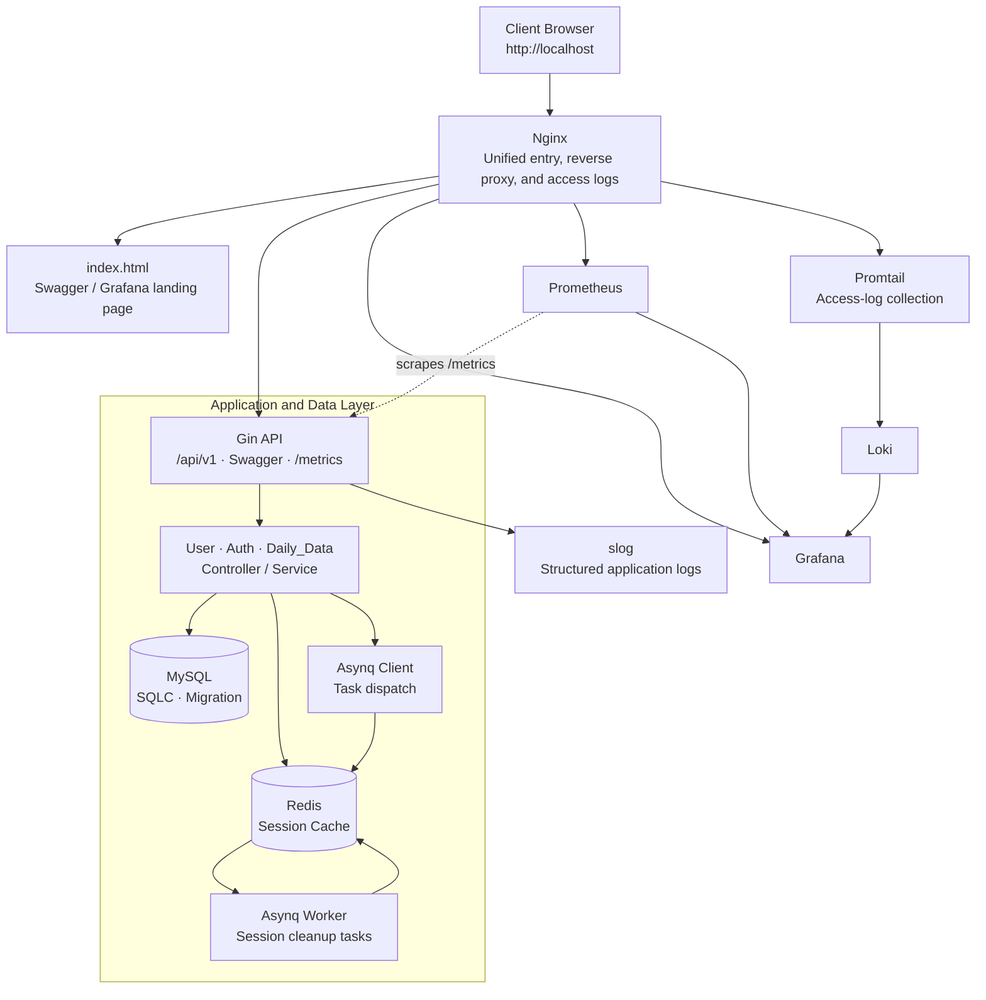

# Go Estate

[中文](README.md) | English

## Project Overview

Go Estate is a Go backend service for real-estate transaction data. Built on Gin, it uses a clear Controller / Service / DAO architecture around users, authentication, and daily transaction data. Session security, role-based authorization, observability, asynchronous tasks, containerized deployment, and CI testing are designed as one engineering loop rather than as isolated features. The project is intended to demonstrate a maintainable, testable, and frontend-friendly backend service in an open-source setting.

This README is written for a technical interview review. It highlights the engineering trade-offs behind the stack, verifiable test strategy, and an end-to-end design from the client entry point to runtime observability.

### System Architecture

> The diagram below is a system architecture overview that renders directly on GitHub. It can later be replaced with a deployment topology or cloud-resource diagram.



## Core Technology Stack

| Category | Technology | Project usage and problem addressed |
| --- | --- | --- |
| Infrastructure | Docker, Docker Compose | Orchestrates the API, MySQL, Redis, database migration, and observability components as containers. Migration runs after MySQL becomes healthy, and the API starts only after migration completes, reducing drift between local and CI environments. |
| Infrastructure | Nginx | Provides a unified entry point, reverse proxy, and access logs for the API, Swagger, Grafana, and Prometheus. |
| Infrastructure | GitHub Actions | CI is split into unit and integration stages: it runs coverage tests and build checks first, then starts the Docker environment, waits for migration, and runs tests against a real database. |
| Storage | MySQL, golang-migrate | MySQL persists users, sessions, and daily transaction data. Versioned migrations make schema and seed-data evolution repeatable. |
| Storage | SQLC | Generates type-safe DAO code from SQL queries, avoiding handwritten scans and string-built queries. The Store also abstracts transactions so password changes and Session invalidation share one transactional boundary. |
| Storage | Redis | Caches Refresh Token Sessions. Token refresh checks the cache first, falls back to MySQL on a miss, and asynchronously repopulates the cache—balancing read performance and consistency. |
| Observability | Prometheus, Grafana | Gin exports Prometheus metrics, while Grafana uses provisioned data sources and dashboards to surface service health. |
| Observability | Loki, Promtail, slog | Compose provisions log-aggregation components, and Promtail defines Gin / Nginx log collection paths. The service uses structured `slog` fields for HTTP status, business code, latency, path, and errors, providing a consistent foundation for Loki search, diagnostics, and alerting. |
| Async processing | Asynq | Uses Redis to queue Session-cache cleanup tasks. Logout and password changes first complete the critical database state transition, then remove cache entries asynchronously with timeout and retry policies so non-critical I/O does not block the request. |

## Modules and Test Assurance

### Core Business Modules

- **User**: Supports normal-user registration, admin-created VIP accounts, and profile lookup and updates. The Service layer enforces the “owner or admin” access boundary. A password update invalidates related Sessions transactionally and clears the cache asynchronously, preventing stale tokens from remaining valid.
- **Auth**: Handles login, Access Token refresh, and device-scoped logout. Login issues Access / Refresh Tokens, writes the Refresh Token to an `HttpOnly` cookie, and records Session information with device ID, User-Agent, and client IP. Refresh validation is Redis-first with MySQL fallback.
- **Daily_Data**: Offers per-day, date-range, and full-data queries. Access scope maps directly to roles: `User` can query a day, `VIP` can query a period, and `Admin` can query all data, keeping authorization out of scattered business branches.

### Layered Test Strategy

The project uses a layered strategy of **Service / Controller unit tests plus DAO integration tests against a real database**, balancing test speed with confidence.

- **Controller unit tests**: Gin test requests with mocked Services and Token Makers validate routes, middleware, request binding, authorization, and the common response contract.
- **Service unit tests**: `gomock` isolates external dependencies such as Store, Redis Cache, and task distributor, allowing business rules, Session handling, transaction orchestration, and error mapping to be tested directly.
- **DAO integration tests**: DAO tests use the `integration` build tag and a real MySQL instance to validate SQLC-generated queries, unique constraints, Session state, and data operations instead of relying only on SQL mocks.
- **CI guardrail**: `.github/workflows/unit-test.yml` runs `go test -v -cover -short ./...`, starts MySQL and migration through Docker Compose, then runs `go test -v -tags=integration ./...`. This detects both logic regressions and SQL / schema mismatches early.

## Engineering Highlights

### Middleware: Request Context and Security Boundaries First

Business APIs compose middleware through layered route groups. Requests under `/api/v1` pass metadata validation first; protected routes then pass authentication; individual resources add role checks where needed. On failure, middleware sends the common business response and aborts the request chain, ensuring an unverified request never reaches a Controller.

- **Metadata extraction and validation**: `RequireMetadata` requires `X-Device-ID` and `User-Agent` and stores them together with the client IP in Gin Context. Auth uses this context to bind Refresh Sessions to a device, client characteristics, and IP, supporting multi-device session management, audit trails, and device-scoped logout instead of relying on a stateless token alone.
- **Token authentication**: `RequireAuth` accepts only a well-formed `Bearer` header and verifies JWT signature, expiration, and token type. Only an Access Token can reach protected resources. The verified payload is stored in Context, so Controllers and Services consume trusted identity data without reparsing tokens.
- **Role authorization**: `RequireRoles` reads the authenticated role from the payload and compares it with the role set declared by the route. VIP creation and day / period / full-data queries express authorization close to the route, creating an auditable RBAC boundary.
- **Structured request logs**: `SlogMiddleware` records status, business code, method, path, source IP, latency, and internal errors after each request. It derives Info / Warn / Error severity from HTTP status and business code, making application logs useful for diagnostics and alerting.

### Route Bridging and Centralized Response Delivery

The routing layer organizes public metadata routes and authenticated routes, then wires each module with its Controller and authorization policy. Controllers follow a single “return data or return an error” model. `response.Wrapper` bridges that model to Gin’s native Handler: successful paths receive the common success structure, while failures flow through one error handler.

- Controllers focus on request binding, DTO conversion, and Service calls rather than repeating JSON serialization, status-code decisions, and logging at every branch.
- Successful responses always use `code / msg / data`; error responses use `code / msg`. The frontend can therefore build interceptors and user feedback around one stable contract.
- `NoRoute` also returns the common result structure instead of a framework-default 404 page. It intentionally retains HTTP 404 because a missing route is a protocol-level error; normal business failures use the business-code policy below.

### `BizError` and Unified Responses: A Frontend-Friendly Error Contract

`BizError` is the cross-layer error language. It contains a stable public `Code`, a user-presentable `Msg`, and an underlying `Err` retained only for server-side diagnosis. Services use `WithErr` to preserve root causes from databases, caches, or task systems without exposing implementation details to clients.

| Error category | Business-code range | HTTP policy | Frontend value |
| --- | --- | --- | --- |
| Validation | `400xx` | `200` | Displays field or format feedback; validation errors are translated into readable messages. |
| Authentication / authorization | `401xx` | `200` | Triggers login, token refresh, or a permission prompt instead of treating a business rejection as a network failure. |
| Resource / conflict | `404xx`, `409xx` | `200` | Reliably distinguishes an absent resource from expected conflicts such as duplicate username or email. |
| Server failure | `500xx` or unknown errors | `500` | Lets the client show a fallback message while the server retains the original error for investigation. |

- `response.Fail` uses `errors.As` to identify request-binding errors and `BizError`. The former becomes a common validation response; the latter is emitted by business code. Unknown errors are collapsed into the generic `50000` response to prevent internal-detail leakage.
- Expected business failures return HTTP `200` and convey the result through `Code + Msg`. This gives browser, mobile, and gateway clients one stable rule for login expiry, insufficient permission, and resource conflicts.
- Only `500xx` business failures and unclassified errors return HTTP `500`. The `NoRoute` behavior above is the intentional HTTP `404` exception for a protocol-level error, while still using the same JSON result structure.
- `response.Fail` records errors in Gin Context, and `SlogMiddleware` emits them with the associated `BizCode`. This creates a two-track error model: stable for the frontend and traceable for backend operators.

## Quick Start

### Prerequisites

- Docker Desktop with Docker Compose installed.
- The Compose configuration contains local-development default credentials. Use secure environment variables or a secret manager before any production deployment.

### Start the Full Stack

```bash
git clone https://github.com/raozhaizhu/go-estate.git
cd go-estate
docker compose up -d --build
```

For legacy Docker Compose installations:

```bash
docker-compose up -d --build
```

This starts the API, MySQL, Redis, Migration, Nginx, Prometheus, Grafana, Loki, and Promtail. The API starts after a successful migration. When the services are ready, visit:

- API health check: `http://localhost:8080/ping`
- **System landing page**: `http://localhost/`. The root path serves `index.html` with basic service information and links to Swagger and Grafana.
- Swagger: `http://localhost:8080/swagger/index.html`
- Grafana: `http://localhost/grafana/`
- Prometheus: `http://localhost/prometheus/`

If the existing image is sufficient, omit `--build`: `docker compose up -d`.
